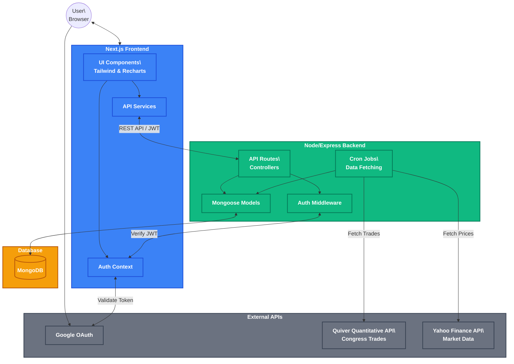

# Nexus Alpha

A comprehensive web application that tracks stock trades made by members of the U.S. Congress. Stay informed about the financial activities of politicians, track their trading performance, and save interesting trades for your own research.

## Features

- **Politician Watchlist**: Add politicians to your personal watchlist to easily track their trading activities.
- **Saved Alpha**: Save specific trades that catch your eye to your profile for quick reference and analysis.
- **Interactive Dashboards**: Visualize trading data and portfolio impacts using interactive charts (powered by Recharts).
- **Secure Authentication**: Supports both local email/password registration and Google OAuth for seamless login.
- **Automated Data Fetching**: The backend uses the Quiver Quantitative API for congressional trading activity and Yahoo Finance API for market data, automated via scheduled cron jobs.

## Tech Stack

### Frontend
- **Framework**: [Next.js](https://nextjs.org/) (React 19)
- **Styling**: [Tailwind CSS 4](https://tailwindcss.com/)
- **Charts**: [Recharts](https://recharts.org/)
- **Icons**: [Lucide React](https://lucide.dev/)
- **Authentication**: Custom JWT Authentication & Google OAuth (`@react-oauth/google`)

### Backend
- **Runtime**: [Node.js](https://nodejs.org/)
- **Framework**: [Express.js](https://expressjs.com/)
- **Database**: [MongoDB](https://www.mongodb.com/) (Mongoose)
- **Authentication**: JWT & `google-auth-library`
- **Data & Scheduling**: `axios` (Quiver API), `yahoo-finance2`, and `node-cron`

## Architecture Overview



## Getting Started

### Prerequisites
- Node.js (v18+)
- MongoDB instance (local or Atlas)
- Google Cloud Console account (for Google OAuth Client ID)

### Installation

1. **Clone the repository**
   ```bash
   git clone <repository-url>
   cd nexus-alpha
   ```

2. **Backend Setup**
   ```bash
   cd backend
   npm install
   ```
   Create a `.env` file in the `backend` directory:
   ```env
   PORT=4000
   MONGO_URI=your_mongodb_connection_string
   JWT_SECRET=your_jwt_secret_key
   GOOGLE_CLIENT_ID=your_google_client_id
   QUIVER_API_KEY=your_quiver_api_key
   ```
   Start the backend development server:
   ```bash
   npm run dev
   ```

3. **Frontend Setup**
   Open a new terminal window and navigate to the frontend directory:
   ```bash
   cd frontend
   npm install
   ```
   Create a `.env.local` file in the `frontend` directory:
   ```env
   NEXT_PUBLIC_API_URL=http://localhost:4000
   NEXT_PUBLIC_GOOGLE_CLIENT_ID=your_google_client_id
   ```
   Start the frontend development server:
   ```bash
   npm run dev
   ```

4. **View the Application**
   Open your browser and navigate to `http://localhost:3000`.

## License

This project is licensed under the ISC License.
